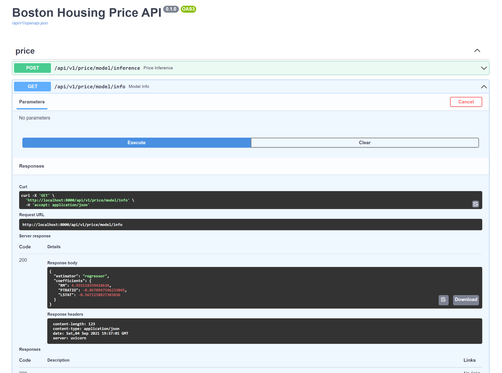

# Boston Housing Price Model - FastAPI Demo

Expose a trained and saved [linear regression](https://scikit-learn.org/stable/modules/generated/sklearn.linear_model.LinearRegression.html) model with [FastAPI](https://fastapi.tiangolo.com/).


The Boston house-prices dataset was used to train the model. From EDA only 3 features are selected for modeling, namely: `RM`, `PTRATIO`, and `LSTAT`. Refer to notebook found in `notebooks/boston-housing.ipynb`.


## Install Requirements in a Virtual Environment

```
python -m venv venv
pip install -r requirements.txt
```

## Run the Server:

```
cd app
uvicorn main:app --reload
```

Then go to http://localhost:8000/api/v1/docs


## Alternative: Run with Docker

Build the image:
```
$ docker build -t myimage .
```

Start the Docker container:
```
$ docker run -p 8000:8000 myimage
```

